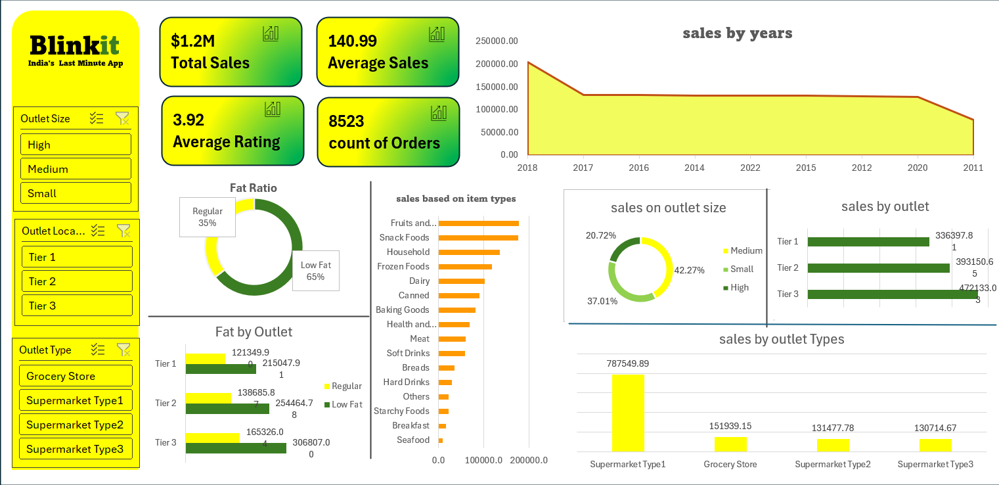

# Retail Sales Intelligence Dashboard

> Analysing $1.2M in Blinkit sales data using Excel — uncovering revenue trends by outlet, location, and product category.


---

## Overview

This project analyses Blinkit's retail sales data using Microsoft Excel to build an interactive, dynamic dashboard. The dashboard provides actionable insights into sales performance across outlet types, location tiers, and product categories — helping drive data-informed stocking and business decisions.

**Total sales analysed: $1.2M | Orders: 8,523 | Outlets: Multiple tiers**

---

## Dashboard Preview

<!-- Add screenshot below -->


---

## Key Insights

| Finding | Detail |
|---|---|
| Total Sales | **$1.2M** across 8,523 orders |
| Top outlet by revenue | **Tier 3 outlets — $472K** (highest among all tiers) |
| Top outlet type | **Supermarket Type 1 — $787K** (62% of total sales) |
| Top selling categories | **Fruits & Vegetables, Snack Foods** |
| Product health trend | **65% of products sold were Low Fat** |
| Average rating | **3.92 / 5** across all outlets |

---

## Features

- Dynamic filters by **Outlet Size**, **Location Tier**, and **Outlet Type**
- KPI cards showing Total Sales, Average Sales, Average Rating, and Order Count
- Sales trend line chart by year
- Fat ratio donut chart (Low Fat vs Regular)
- Bar charts for sales by item type, outlet size, and outlet type
- Fully interactive slicers for drill-down analysis

---

## Tech Stack

| Tool | Purpose |
|---|---|
| Microsoft Excel | Dashboard creation & analysis |
| Power Query | Data cleaning & transformation |
| SUMIFS / COUNTIFS | Aggregated calculations |
| XLOOKUP / IF | Lookup and conditional logic |
| Pivot Tables & Charts | Visual summaries |

---

## Data Cleaning Steps

- Removed duplicate records and null values using Power Query
- Standardised outlet type and location tier categories
- Validated sales figures and corrected data type mismatches
- Created calculated columns for fat ratio classification

---

## Project Structure

```
Retail-Sales-Dashboard/
│
├── Blinkit_Sales_Dashboard.xlsx   # Main Excel dashboard file
├── raw_data/
│   └── blinkit_data.csv           # Original dataset
├── screenshots/
│   └── dashboard.png              # Dashboard preview image
└── README.md
```

---

## How to Use

1. Download `Blinkit_Sales_Dashboard.xlsx`
2. Open in Microsoft Excel (2016 or later recommended)
3. Use the slicers on the left panel to filter by Outlet Size, Location, or Type
4. All charts and KPIs update dynamically based on your selection

---

## Author

**Asif Iqbal Shaikh**
📧 sasif9226@gmail.com
🔗 [LinkedIn](https://www.linkedin.com/in/asif-shaikh-5487a9270)
🐙 [GitHub](https://github.com/AsifShaikh-ui)
